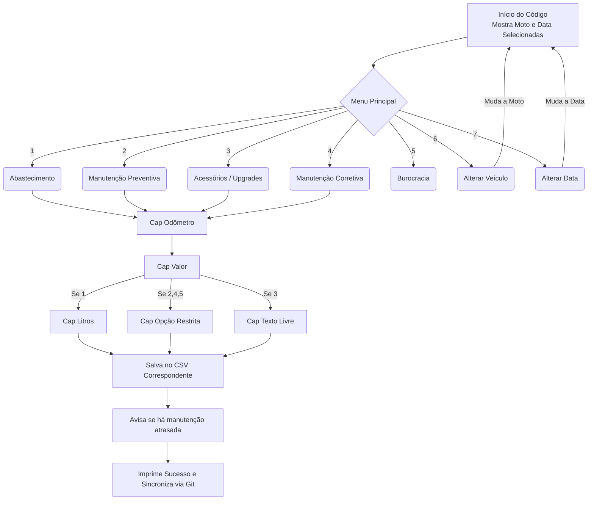

# MotoRegis 🏍️

Um sistema minimalista via linha de comando (CLI) (inicialmente) para registro de abastecimentos, manutenções e customizações de motores. Desenvolvido com foco em velocidade, **baixa fricção** e na filosofia KISS (*Keep It Simple, Stupid*).

Pensado para uso rápido em cotidiano via Termux, com os dados sendo versionados via Git para análises posteriores no PC (inicialmente).

---

## 🧠 Filosofia e Arquitetura

O projeto é estritamente dividido para manter a simplicidade e a segurança dos dados:
* **Interface e Lógica:** Script em Python puro.
* **Armazenamento:** Arquivo `.csv` (agnóstico e perfeito para análise de dados).
* **Configuração:** Arquivo `.json` estritamente **somente leitura** pelo script.
* **Manutenção das configurações:** Script em Python puro dedicado a isso ou manualmente.

---

## ⚙️ Configuração

Para evitar acidentes e simplificar o código, o script de acesso ao usuário não altera as configurações. A mudança de configurações deve ser realizada manualmente ou via script dedicado guardado em uma pasta oculta.

**Exemplo de configs.json:**
```json
{
  "veiculos_index": {
    "Royal Enfield Himalayan 411": "veiculos/himalayan_22.json",
    "Toyota Etios": "veiculos/etios_16.json"
  },
  "categorias_menu": [
    "Abastecimento",
    "Manutenção Preventiva",
    "Acessórios / Upgrades",
    "Manutenção Corretiva",
    "Burocracia",
    "Alterar Veículo",
    "Alterar Data"
  ]
}
```

---

## 🗃️ Estrutura de Dados (O CSV)

Todos os registros são salvos no arquivo configurado, seguindo a estrutura de colunas abaixo. Isso garante que a importação via Pandas ou outras ferramentas de análise seja direta.

| Coluna | Tipo | Descrição | Exemplo |
| :--- | :--- | :--- | :--- |
| `data` | String | Data do registro | 2026-04-14 |
| `moto` | String | Identificador da moto (puxado do config) | Himalayan 411 |
| `odometro` | Int | Quilometragem atual | 15400 |
| `tipo` | Int | Categoria do gasto (1: Abast, 2: Manut_Prev, 3: Acessorios, 4: Manut_Cor, 5: Buro) | 1 |
| `valor_gasto`| Float | Custo total da operação em Reais | 85.50 |
| `detalhes` | String | Litros, peça trocada ou local | oleo_motor |
| `litros` | Float | total em L abastecidos | 14.2 |

---

## 🚀 Como Usar

1. Execute o script no terminal:
   ```bash
   python3 motoregis.py
   ```
2. Verifique se o registro de interesse corresponde à moto e à data apresentadas inicialmente pelo script.
3. Siga o menu interativo:
   * `1` - Abastecimento
   * `2` - Manutenção Preventiva
   * `3` - Acessórios / Upgrades
   * `4` - Manutenção Corretiva
   * `5` - Burocracia
   * `6` - Alterar Veículo
   * `7` - Alterar Data
4. Sincronize via Git caso tenha internet.

---

## 📊 Fluxo de Funcionamento



---

## 🗺️ Roadmap e Ideias Futuras

- [x] **Validadores Robustos:** Funções isoladas para captura de inteiros (`select_index`) e decimais (`get_float`) com tratamento de erros implementadas.
- [ ] **Validador de Odômetro:** Impedir entrada de quilometragem menor que a última registrada.
- [ ] **Sync Automático:** Integrar comandos do Git diretamente no Python para fazer *commit* e *push* silenciosos após cada novo registro.
- [ ] **Evolução da Interface:** A lógica de validação e I/O de dados está isolada. No futuro, avaliar a migração da CLI atual para uma TUI (ex: Textual/Rich) ou uma GUI Mobile (Flet), mantendo o mesmo arquivo CSV como base.
- [ ] **Análise dos dados:** Geradas no próprio celular caso migre pra TUI ou GUI, ou somente no computador caso siga apenas via linha de comando.
